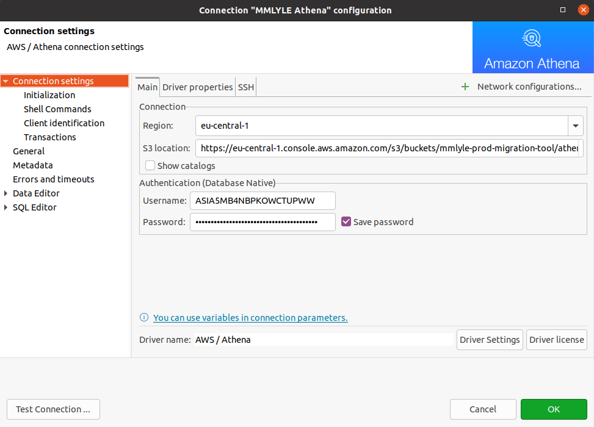
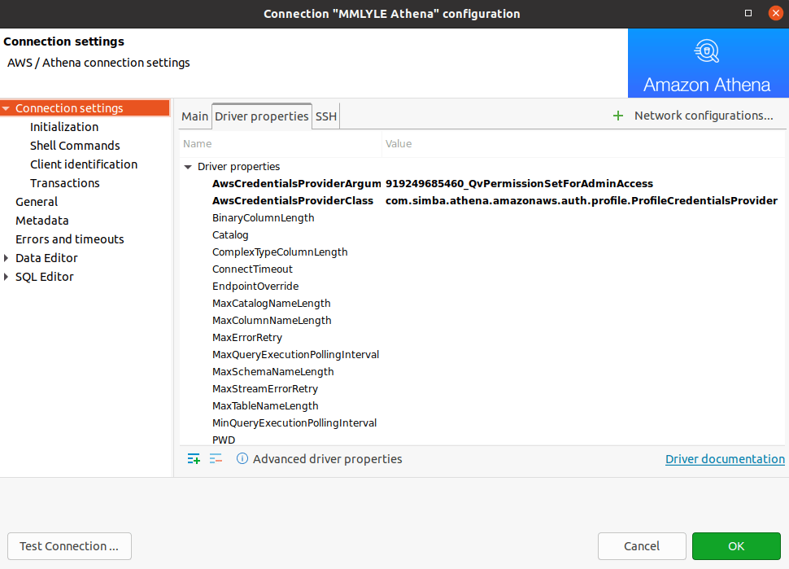
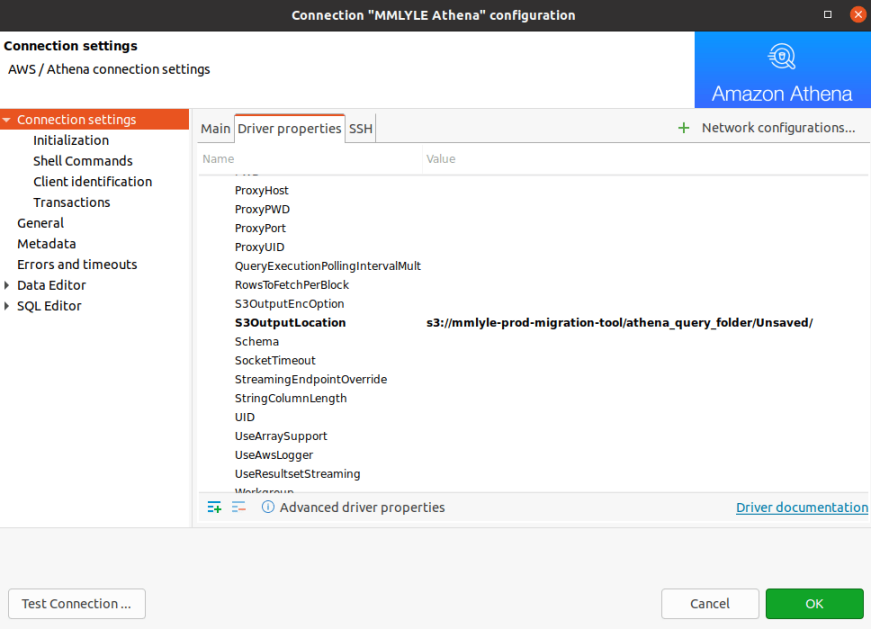

ATHENA
======

# Connecting from DBeaver using Simba JDBC driver
Use the **aws_access_key_id** from `~/.aws/credentials` concrete profile as Username, and the **aws_secret_access_key** there as Password:



In Driver properties, set `AwsCredentialsProviderClass` to: 
  `com.simba.athena.amazonaws.auth.profile.ProfileCredentialsProvider`

and `AwsCredentialsProviderArguments` equal to the name of the profile you want to use:



Also, set the `S3OutputLocation` driver property to a proper folder in the S3 bucket:



___
# Creating a partitioned table from the contents of a S3 bucket folder
  Note the custom separator character for the CSV files stored in partitions in S3:
  
```sql
CREATE EXTERNAL TABLE IF NOT EXISTS `mydb`.`mytable` (
    `field1` string,
    `field2` string,
    `field3` string
  )
  PARTITIONED BY (pyear string, pmonth string, pday string)
  ROW FORMAT SERDE 'org.apache.hadoop.hive.serde2.OpenCSVSerde'
  WITH SERDEPROPERTIES (
    'separatorChar' = '~',
    'quoteChar' = '\"',
    'escapeChar' = '\\'
  )
  STORED AS INPUTFORMAT 'org.apache.hadoop.mapred.TextInputFormat' OUTPUTFORMAT 'org.apache.hadoop.hive.ql.io.HiveIgnoreKeyTextOutputFormat'
  LOCATION 's3://mybucket/mytable/'
  TBLPROPERTIES (
    'classification' = 'csv',
    'skip.header.line.count' = '1'
  );
  
```
  Then, to force the read/update of the data contained in all of the *CSV files:

```sql
  MSCK REPAIR TABLE `mydb`.`mytable` ;
```
___
# Get the file name (without extension) rows were loaded from
```sql
  SELECT regexp_extract("$path", '[ \w-]+?(?=\.)') AS filename from "mydb"."mytable";
```
