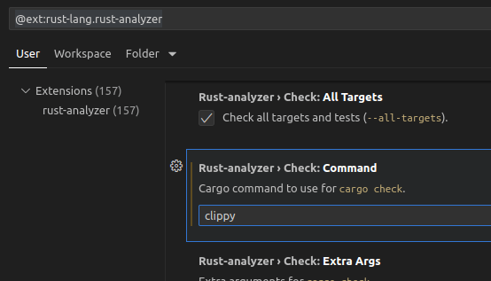

Rust
====

## Basics
To upgrade installed compiler to the latest available release version:
```bash
rustup update
```
Show lint suggestions to your code using [Clippy](https://github.com/rust-lang/rust-clippy) :
```bash
cargo clippy
```
Or you can transparently use it from VSCode by setting it instead or `cargo check`:


 
To make the compiled executable even smaller than the one generated by the `cargo build --release` command, just strip all the symbols away from it:
```bash
strip --strip-all myexecutable
```

Generate HTML documentation for your project:
```bash
cargo doc
# And the you can open it in the default browser doing
cargo doc --open
```
## match

```rust
fn main() {
  let x = 42;
  let myextracond = true ;
  match x {
      0 => {
          println!("found zero");
      }
      // we can match against multiple values, and optionally even include a match guard condition
      1 | 2 if myextracond => {
          println!("found 1 or 2!");
      }
      // we can match against ranges
      3..=9 => {
          println!("found a number 3 to 9 inclusively");
      }
      // we can bind the matched number to a variable
      matched_num @ 10..=100 => {
          println!("found {} number between 10 to 100!", matched_num);
      }
      // this is the default match that must exist if not all cases are handled
      _ => {
          println!("found something else!");
      }
  }
}
```

Can return values:
```rust
let food = "hamburger";
let result = match food {
  "hotdog" => "is hotdog",
  // notice the braces are optional when its just a single return expression
  _ => "is not hotdog",
};
```
## loop
Can return values:
```rust
let mut x = 0;
let v = loop {
    x += 1;
    if x == 13 {
        break "found the 13";
    }
};
```
## Strings
Rust strings are multi-line by default. Use a `\` at the end of a line if you don't want a line break:
```rust
fn main() {
    let haiku: &'static str = "
I write, erase, rewrite
Erase again, and then
A poppy blooms.
- Tachibana Hokushi";
    println!("{}", haiku);

    println!("hello \
    world") // notice that the spacing before w is ignored
}
```

**Raw string** literals allow us to write a sequence of characters verbatim by starting with `r#"` and ending with `"#` :
```rust
let a: &'static str = r#"
    <div class="advice">
        This '\n' will be printed as you wrote it.
    </div>
    "#; // Notice that multiline strings indentation is KEPT
println!("{}", a);
```

If you have some very large text, consider using the macro `include_str!` to include text from local files in your program:
```rust
let hello_html = include_str!("hello.html");
```
## Enums
Can hold arbitrary data fields, either in the form of positional or named arguments:
```rust
enum Message {
    Quit,
    Move { x: i32, y: i32 },
    Write(String),
    ChangeColor(i32, i32, i32),
}
```

Works with generics too, like the standard:
```rust
pub enum Option<T> {
    None,
    Some(T),
}
```
Can be desestructured in matches, even when nested:
```rust
enum Color {
    Rgb(i32, i32, i32),
    Hsv(i32, i32, i32),
}

enum Message {
    Quit,
    Move { x: i32, y: i32 },
    Write(String),
    ChangeColor(Color),
}

fn main() {
    let msg = Message::ChangeColor(Color::Hsv(0, 160, 255));

    match msg {
        Message::ChangeColor(Color::Rgb(r, g, b)) => {
            println!("Change color to red {r}, green {g}, and blue {b}");
        }
        Message::ChangeColor(Color::Hsv(h, s, v)) => {
            println!("Change color to hue {h}, saturation {s}, value {v}")
        }
        _ => (),
    }
}
```
Note that the name of each enum variant that we define also becomes an initializer function. So, we can use those as arguments for methods that take closures:
```rust
enum Status {
    Value(u32),
    Stop,
}
let list_of_statuses: Vec<Status> = (0u32..20).map(Status::Value).collect();
```